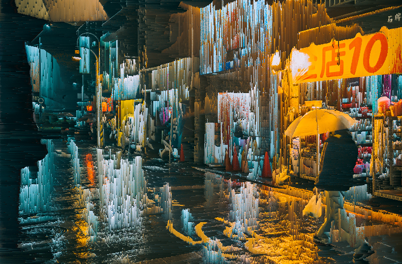
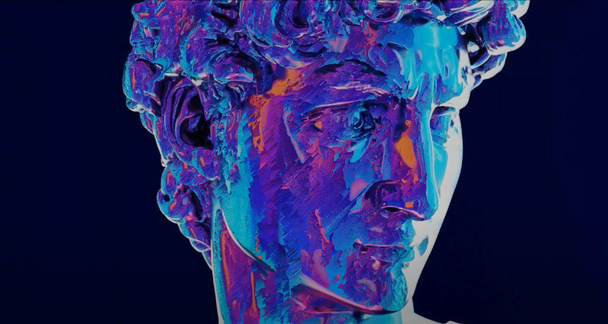

# PixelSorter
  Here is a custom pixel sorting Filter I made as a hobby. An art_generator notebook is included to show how to use the pixelsorter.
  
  Using the pixelsorter.py it is possible to sort an image to create a unique glitch effect.
  Segmentation- and Depth-estimation models are used to allow for more special art. The Pixelsorter needs a mask, which shows the picture what pixels should be sorted. 
  This is made seperate from the pixelsorter to allow for more freedom in the use of the mask.
  The Segmentation model can be used to create multiple masks, which allows us to sort just instances and keep the forms more recognisable.

  The important Parameters of the pixelsorter Function are:
  - image: the image that is getting sorted
  - mask: a binary mask of the image.
  - sort_type: which channel we sort by ('red' & 'hue' as examples). can be used for different Color spaces (RGB, HSV, OKlch )
  - sort_direction: the options we create an array to sort the pixels by (vertical,horizontal, flowfield)
  - sort_ascend: Bool to switch direction of which we sort by
  - split_interval_groups: if we want to split the created arrays to sort even more to minimize process time.
  - intervalrandom_range: tupel that defines the random range of which an interval of the intrerval groups can be
  - flowfield: the precomputed flowfield that is used to sort the pixels by when the sort_direction is set to flowfield.  

An example of processed image that uses vertical sorting from the mask and horizontal sorting from the inverted mask:

  The gradient sorting direction is why I created a custom project for image generation. Using the depth estimator we create a depth map from the image. Then the vectorfield as the gradient of the image is created. 
  The vectors are then normalised and discretised so every pixel points to another in its neigborhood. This creates trees of pixel which is splitted into many disjunct lists using breadth first search. 
  Using this gradient based pixel sorter with depth map creates a pseudo 3D effect that can be experimented on with different color space channels

An example of gradient based pixel sorting:

